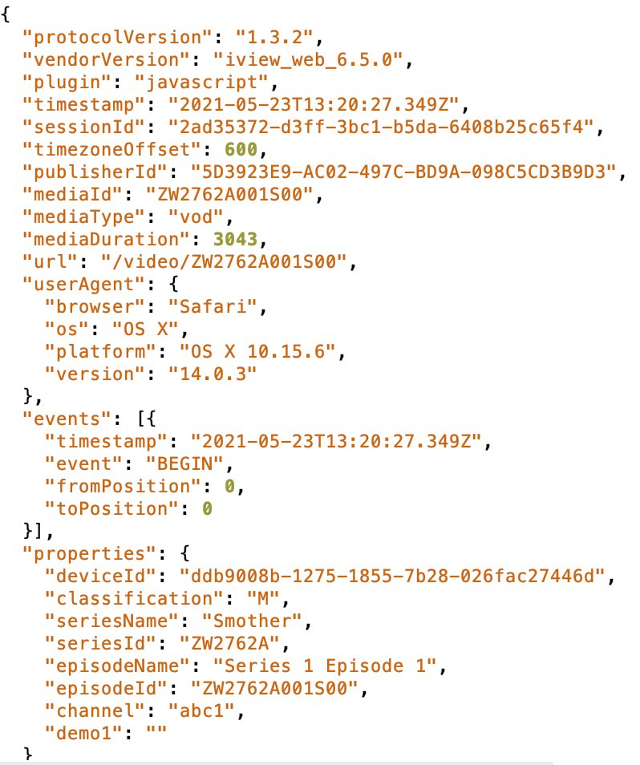

# ABCData
Consideration of a public response to ABC data collection and sharing. The main issues are described [here](abc.md).

You are welcome to re-use (with your own edits) any of the following.

- [My draft for the ABC board](https://github.com/AusOpenTech/ABCData/raw/main/ABCData.docx), or this [slightly-different version](https://github.com/AusOpenTech/ABCData/raw/main/ABCData_ThirdParty.docx) with the ABC as a third party - I sent it to the [Minister for Communications](https://minister.infrastructure.gov.au/fletcher/contact), the [Shadow Minister for Communications](https://www.aph.gov.au/Senators_and_Members/Parliamentarian?MPID=159771#t2-content-panel), and the [Greens Spokesperson on communications](https://www.aph.gov.au/Senators_and_Members/Parliamentarian?MPID=I0U#t2-content-panel). 
- Anna Johnston of Salinger Privacy added [this examination](https://github.com/AusOpenTech/ABCData/raw/main/21_05_27_letter_to_ABC_re_iView_login_clean.docx) of the inconsistencies with the Australian Privacy Principles and the ABC's charter. Here is the [editable version].
- [Malcolm Crompton's version](https://github.com/AusOpenTech/ABCData/raw/main/Malcolm_Crompton_Letter_to_David_Anderson_ABC.docx) also emphasises the legal implications of sharing data without consent.

For background reading, you might like to read the ABC's new [privacy collection statement](https://help.abc.net.au/hc/en-us/articles/360001511015-ABC-Privacy-Collection-Statement-) or [privacy policy](https://help.abc.net.au/hc/en-us/articles/360001154976).  Make sure you click on the drop-downs.

Note also that there is currently no opt-out.  Furthermore, the proposed opt-out for those with accounts will apply only to the sharing of email addresses, not to the sharing of other data.  At present, a careful reading of the Privacy Policy does not indicate any option to opt out of any other data sharing.

[InnovationAus covered](
https://www.innovationaus.com/experts-urge-abc-to-reverse-risky-log-in-requirement/) a Senate Estimates hearing in which ABC managing director  David Anderson justified this behaviour as "standard practice."

You might also like to [join the discussion](https://github.com/AusOpenTech/ABCData/discussions) on technical options for non-cooperation.

For a concrete idea of the data we're talking about, see this capture from @wabzqem: "Current data sent from web player to OzTAM (these types of events are sent regularly throughout playback). They also capture IP." Of course, we don't know how much of this is being retained or shared, but the privacy policy does not give any confidence in this regard.

